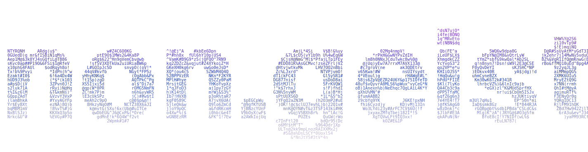
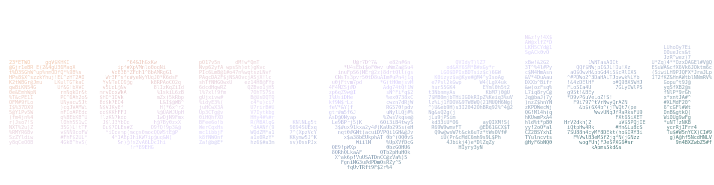

# [non.geist](https://www.npmjs.com/package/non.geist)



A package to use Vercelʼs typefaces, [Geist](https://vercel.com/font)－ Sans & Mono (**v 1.4**), for non-Next.js projects.

## The Why

I tried to use [Geist](https://www.npmjs.com/package/geist) in a React project, it errored out (it depends on `next/font`). I like the flexibility a package offers － not having to manage assets (or dependencies); I take it a lot of devs prefer this, maybe.<br/>Now, itʼs not even a hassle to `@font-face` a font (or typeface), itʼs even easier with [variable fonts](https://fonts.google.com/knowledge/introducing_type/introducing_variable_fonts). Regardless, itʼs a solid nice-to-have (package).

## Installation

```bash
npm i non.geist
```

```bash
yarn add non.geist
```

```bash
pnpm i non.geist
```

```bash
bun add non.geist
```

## Usage

The default import provides **variable fonts**.

In your entry .js(x) or .ts(x) file, you can import like so:

```js
import 'non.geist'

// For Geist Mono
import 'non.geist/mono'
```

then,

```css
body {
  font-family: 'Geist Variable';

  /* For Geist Mono */
  font-family: 'Geist Mono Variable';
}
```

or do it in CSS directly

```css
@import url('non.geist');

body {
  font-family: 'Geist Variable';
}
/* For Geist Mono */

@import url('non.geist/mono');
font-family: 'Geist Mono Variable';
```

Variable fonts all the way, but if you need Geist sans individual weights:

```bash
import 'non.geist/font-faces/Geist-Black.css'
import 'non.geist/font-faces/Geist-Bold.css'
import 'non.geist/font-faces/Geist-Light.css'
import 'non.geist/font-faces/Geist-Medium.css'
import 'non.geist/font-faces/Geist-Regular.css'
import 'non.geist/font-faces/Geist-SemiBold.css'
import 'non.geist/font-faces/Geist-Thin.css'
import 'non.geist/font-faces/Geist-UltraBlack.css'
import 'non.geist/font-faces/Geist-UltraLight.css'
```

For Geist Mono:

```bash
import 'non.geist/font-faces/GeistMono-Black.css'
import 'non.geist/font-faces/GeistMono-Bold.css'
import 'non.geist/font-faces/GeistMono-Light.css'
import 'non.geist/font-faces/GeistMono-Medium.css'
import 'non.geist/font-faces/GeistMono-Regular.css'
import 'non.geist/font-faces/GeistMono-SemiBold.css'
import 'non.geist/font-faces/GeistMono-Thin.css'
import 'non.geist/font-faces/GeistMono-UltraBlack.css'
import 'non.geist/font-faces/Geist-MonoUltraLight.css'
```

`font-family` values for individual weights:

```css
@import url('non.geist/font-faces/Geist-Bold.css');

font-family: 'Geist-Bold';
/* Geist Mono */
@import url('non.geist/font-faces/GeistMono-Bold.css');

font-family: 'GeistMono-Bold';
```

## Miscellaneous

Additional `@font-face` rules:

```css
font-display: swap;
font-synthesis: none;
```

To explore the typefaces stylistic sets, use CSS's `font-feature-settings` property.

## License

[License](https://github.com/vercel/geist-font/blob/main/LICENSE.TXT)

## Credits

Thank you [Vercel](https://vercel.com/home)

---

### Development

To install dependencies:

```bash
bun install
```

To run:

```bash
cd ./scripts
bun run index.ts
```

This project was created using `bun init` in bun v1.0.3. [Bun](https://bun.sh) is a fast all-in-one JavaScript runtime.


